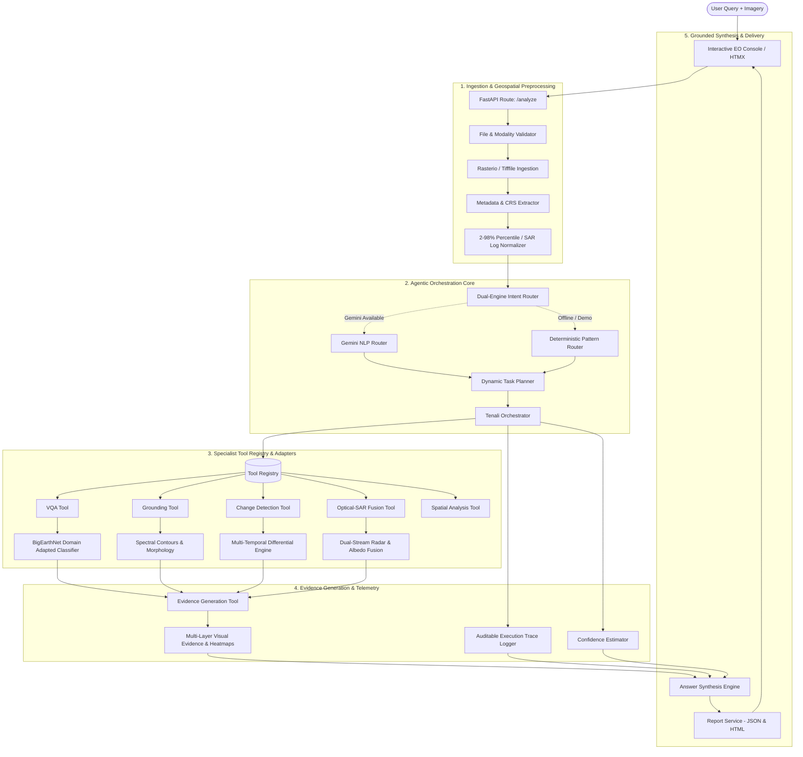

# TENALI AI — Architectural Design Document

> **SIH 26167: Vision-Language Assistant for Multimodal Remote Sensing Image Analysis**  
> *"Ask the Earth. Understand the Change."*

---

## 1. System Architecture Overview

TENALI AI is designed around a **Query-Driven Agentic Orchestration Architecture**. Unlike generic "Image $\to$ LLM $\to$ Text" chatbots, remote-sensing data requires specialized raster ingestion, radiometric normalization, band combination, spectral index calculation, differential morphology, and spatial coordinate transforms.

The following diagram illustrates the complete end-to-end processing pipeline:



---

## 2. Architectural Layers & Responsibilities

### A. Presentation Layer (Python-First Web UI)
- **FastAPI + Jinja2 + HTMX**: Delivers a lightweight, reactive console without the bloat of external node/npm servers.
- **Tailwind CSS**: Professional Earth Observation command-center aesthetic (deep space navy `#070b14`, cyan `#06b6d4`, amber `#f59e0b`).
- **Interactive Multi-Layer Viewer (`viewer.js`)**: Provides split-screen comparison swipe dividers, layer toggles (Primary, Secondary, Mask, Change Map, Fused), opacity cross-faders, and zoom/pan capabilities.

### B. Ingestion & Geospatial Preprocessing (`app/image/`)
- **`loader.py`**: Safe multi-band GeoTIFF, TIFF, PNG, and JPEG loading with automatic windowing and downsampling safeguards for large satellite rasters.
- **`metadata.py`**: Extracts Coordinate Reference Systems (CRS), tiepoint bounding boxes, pixel resolutions, band counts, and radiometric data types.
- **`normalization.py`**: Implements 2%–98% cumulative percentile linear stretching for optical bands and logarithmic amplitude transformations for SAR radar backscatter.

### C. Agentic Orchestrator & Dual-Engine Router (`app/agent/`)
- **`router.py`**: Dual-engine routing:
  1. *Primary*: Google Gemini API for natural-language semantic parsing and structured intent extraction when `GEMINI_API_KEY` is present.
  2. *Secondary*: Local deterministic keyword and regex pattern router for 100% offline, zero-key hackathon demo operation.
- **`planner.py`**: Constructs multi-step execution graphs (`input_validation` $\to$ `image_metadata_extraction` $\to$ `query_understanding` $\to$ `tool_selection` $\to$ `specialist_analysis` $\to$ `spatial_analysis` $\to$ `evidence_generation` $\to$ `answer_synthesis`).
- **`agent.py`**: Central coordinator executing each planned step, measuring execution durations, and compiling structured telemetry.

### D. Specialist Tool Registry (`app/tools/`)
The tool registry (`ToolRegistry`) decouples the agent's intent from physical model execution. All specialist tools inherit from `BaseTool`:
1. `VQATool`: Answers general and land-cover questions on single satellite rasters.
2. `GroundingTool`: Segments and bounds text-specified geographic objects.
3. `CaptioningTool`: Produces comprehensive scene descriptions and land-use summaries.
4. `ChangeDetectionTool`: Performs multi-temporal differential analysis across $T_1$ and $T_2$.
5. `ChangeStatisticsTool`: Computes changed pixel percentages, trends, and approximate hectare areas.
6. `OpticalSARFusionTool`: Fuses optical multi-spectral reflectance with SAR radar backscatter.
7. `SpatialAnalysisTool`: Enriches pixel bounding boxes with approximate geospatial coordinates.
8. `EvidenceGenerationTool`: Renders semi-transparent masks, change heatmaps, and side-by-side composite collages.

### E. Model Adapters & Domain Adaptation (`app/adapters/`, `app/services/adaptation.py`)
- **Clean Adapter Separation**: Tool interfaces call abstract `BaseAdapter` classes. Demo adapters (`DemoVQAAdapter`, `DemoGroundingAdapter`, `DemoChangeDetectionAdapter`, `DemoOpticalSARAdapter`) use transparent, deterministic image-processing algorithms.
- **Real Remote-Sensing Domain Adaptation**: `RemoteSensingAdaptationService` extracts multi-spectral spectral-spatial feature vectors and predicts across the **BigEarthNet-19 class taxonomy** (derived from CORINE Land Cover standards).

---

## 3. Why Query-Driven Agentic Orchestration?

| Generic Chatbot Approach (`Image → LLM → Text`) | TENALI AI Agentic Remote-Sensing Architecture |
|---|---|
| Treats satellite imagery as standard web JPEGs. | Ingests multi-band GeoTIFFs, preserving CRS, resolution, and radiometric depth. |
| Hallucinates coordinates and unverifiable changes. | Computes numerical difference maps, connected components, and quantitative pixel statistics. |
| Ignores radar physics (pretends SAR is a grayscale photo). | Genuinely processes SAR backscatter physics (specular reflection vs double-bounce vs volume scattering). |
| Black-box response with no audit trail. | Granular execution trace logging tool names, adapters, and latencies. |
| Uncalibrated overconfidence. | Explicitly declared confidence estimates and technical honesty notices. |

---

## 4. Execution Trace Contract

Every analysis produces an auditable trace:
```json
{
  "steps": [
    {
      "step": "input_validation",
      "status": "success",
      "duration_ms": 1.2,
      "details": {"mode": "bi_temporal", "image_count": 2}
    },
    {
      "step": "image_metadata_extraction",
      "status": "success",
      "duration_ms": 4.5,
      "details": {"primary": {"crs": "EPSG:32643", "width": 512, "height": 512}}
    },
    {
      "step": "query_understanding",
      "status": "success",
      "duration_ms": 2.1,
      "details": {"task_type": "bi_temporal_change", "router_engine": "Deterministic Rule Router"}
    },
    {
      "step": "specialist_analysis",
      "status": "success",
      "tool": "change_detection_tool",
      "implementation": "DemoChangeDetectionAdapter",
      "duration_ms": 28.4,
      "details": {"changed_percent": 14.82, "trend": "increased"}
    },
    {
      "step": "evidence_generation",
      "status": "success",
      "tool": "evidence_generation_tool",
      "duration_ms": 19.8,
      "details": {"artifacts_rendered": ["t1", "t2", "change_map", "composite"]}
    }
  ],
  "total_duration_ms": 56.0
}
```
